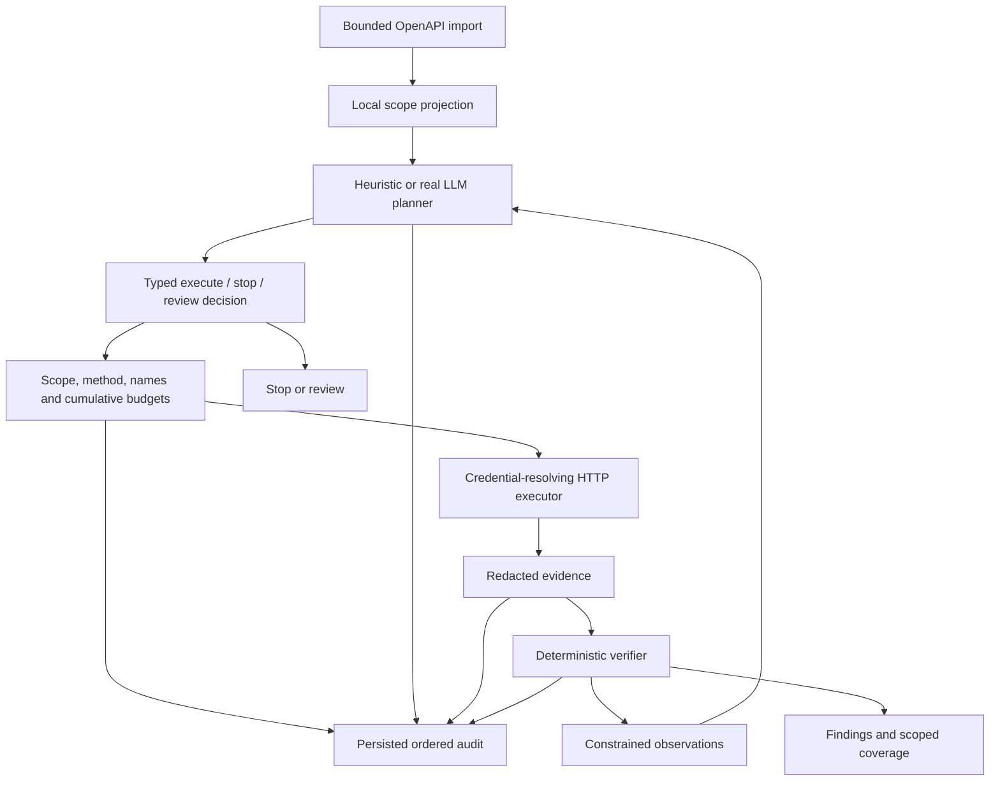

# Phase 0.2 implementation record

## Baseline inspection

The supplied directory contained the Phase 0 FastAPI control plane, HTTPX executor, SQLite store,
static dashboard, synthetic lab API and eight tests. It contained no `.git` directory, AGENTS.md,
canonical state document or local `.env`. The stated base commit `3cc4e22` cannot be verified from
this snapshot. No replacement Git history was initialized. A pre-edit copy was retained under
`/private/tmp/aegis-phase02-baseline` for this session.

Baseline gaps addressed: single-pass planning; unbounded provider output; planner extra fields
silently ignored; OpenAPI import lacked same-origin enforcement; missing route membership checks;
no cumulative budgets; optimistic PASS on no findings; weak evidence binding; no patched retest;
no structured audit details; dashboard incorrectly called SQLite events immutable; static assets
were not explicitly included in installed package data.

## Architecture

The model cannot call HTTP directly. Its structured decision proposes the one typed read-only HTTP
tool. The service imports the fixed OpenAPI document; model output cannot choose the import URL.
The executor rechecks every request at the network boundary. No plugin, shell, file, write or
arbitrary-header capability is exposed to the planner.

Each iteration uses the projected surface, prior observations, current deterministic verification,
remaining budgets and, for retests, the confirmed original access directions. No full response,
OpenAPI prose, prior free-form finding text or credential value enters the model request. The model
adapter retains its provider authentication secret for HTTP authorization, not target settings.

## Deterministic evidence semantics

A confirmed BOLA requires an observed GET 200 bound to the planned name/method/path/profile, the
requested fixture account ID, and its known foreign owner. LLM statements and confidence values
never prove findings. Duplicate evidence names, mismatched identities and transport errors cannot
be promoted to findings.

A scoped PASS requires successful owner controls for both synthetic principals and a cross-owner
403 with the fixture's exact denial body. HEAD, OPTIONS, empty evidence, denial alone, 404, redirects,
server errors, malformed identities and unsupported categories do not establish coverage. A
retest additionally requires every original confirmed principal/object direction to be denied on
the patched route. Original evidence is never reused as fresh retest evidence.

`FAIL` means evidence proves a finding, including when later work is interrupted. `PASS` requires
sufficient verification plus an orderly planner stop. `REVIEW` represents planner review requests
or safety rejection; `INCOMPLETE` represents insufficient coverage, provider failures or exhaustion.
The stop reason is stored independently, so a confirmed FAIL can also show a later budget limit.

## Resource limits and provider behavior

All target requests, including import and failed attempts, consume the global per-scan request
allowance. Batch proposals are checked against remaining allowance before any member executes.
Iterations and model calls have separate limits. A whole-loop async deadline cancels in-flight
HTTP/provider calls; per-call timeouts and bounded streaming reads apply as well.

Model calls reserve payload bytes + framing allowance + completion cap before sending. The
reservation is deliberately conservative and never refunded. Actual usage fields must be
nonnegative consistent integers within the reservation and output cap. This is not an exact token
count or financial cap for arbitrary compatible providers; the provider remains responsible for
honoring its advertised limits. Unknown usage and provider errors fail closed without fallback.

Audit records include the projected import observation, planner input and validated decision,
proposed tool, safety approval/rejection, request start, response observation, each verifier result,
usage and terminal reason. Rejected provider outputs are represented by a safe diagnostic and a
SHA-256 digest when a complete body was read; raw rejected content is intentionally not persisted.
The SQLite migration preserves legacy events and adds JSON details. Restarted in-process jobs
become INCOMPLETE unless retained evidence still proves a finding (FAIL); jobs are not silently resumed. This is a single-process lab, not a durable queue.

## Remediation demonstration

The vulnerable and patched account routes coexist in the same API. The patched handler enforces
owner equality before serialization. The dashboard's retest button selects the patched surface and
links to a deterministically revalidated parent. This demonstrates a remediation comparison; it
does not deploy a fix, remove the vulnerable route, or permit model-directed mutation.

## Validation and limitations

The automated suite covers offline discovery/retest; full mock-provider loop; prompt injection in
OpenAPI and response text; malformed/extra tool fields; origin/path escape; redirects; budget
admission and exhaustion; timeout and oversized bodies; provider refusal/truncation/errors; redaction;
evidence binding; wrong-direction retest substitution; preservation of confirmed findings; and
legacy audit migration/restart recovery. See PROJECT_STATE.md for final counts and HTTP evidence.

Live LLM behavior, model planning quality and provider endpoint compatibility remain unvalidated.
No key was configured and no provider call was attempted. The model retains genuine choice of
hypothesis, test ordering, profile/object comparison and continuation within the small authorized
lab surface. This is intentionally not a general-purpose OpenAPI inventory or autonomous pentester.

Docker 29 on this machine ignored published ports on an internal-only service. An explicitly
approved optional Nginx gateway provides localhost dashboard ingress. Only that proxy has a second
network, no target credentials, a fixed upstream, read-only filesystem and dropped capabilities.
Both application services remain internal; the vulnerable lab has no published host port. There is
still no live model egress path. Browser visual QA depends on a connected browser; none was available
through the computer-use tool during development.

## Next phase gates

1. Restore the actual Git checkout and commit the reviewed changes without replacing its history.
2. Configure a provider credential locally and approve a constrained model-egress architecture.
3. Run the real model against only this lab, retain mode/model/usage/evidence, and evaluate whether
   test selection adapts usefully to observations. No model-quality claim before this experiment.
4. Add onboarding, global scheduling controls and security hardening before considering any staging
   pilot. External targets remain unauthorized.
